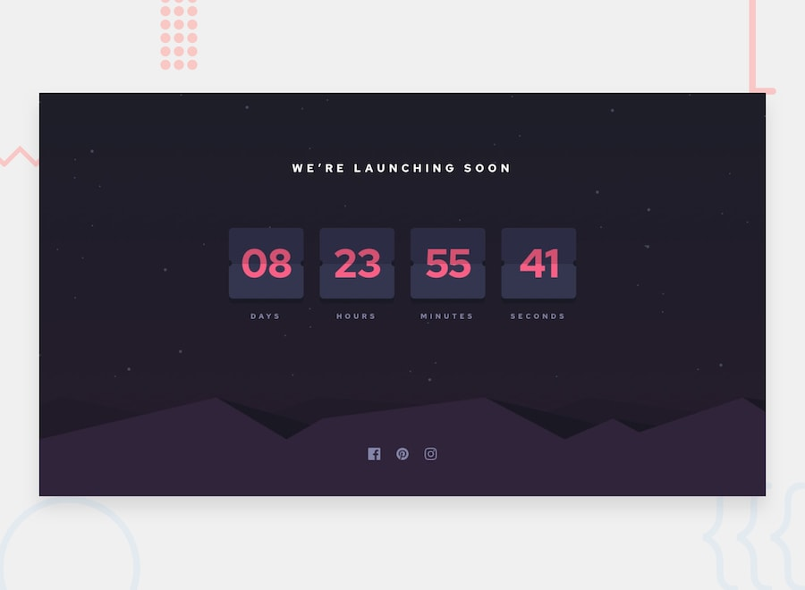

# Frontend Mentor - Launch countdown timer

A countdown timer challenge provided by [Frontend Mentor](https://www.frontendmentor.io).

## Features

-   A countdown timer
-   Responsive design

## Technologies Used

-   [React](https://reactjs.org/)
-   [styled-components](https://styled-components.com/)

## Installation

You will need [Node and npm](https://nodejs.org/en/) installed to run this project.

Clone the project and run `npm install` in the root directory.

To learn React, check out the [React documentation](https://reactjs.org/).

## Running in Development Mode

`npm start`

Runs the app in the development mode. Open [http://localhost:3000](http://localhost:3000) to view it in the browser.

## Testing

`npm test`

Launches the test runner in the interactive watch mode. See the section about [running tests](https://facebook.github.io/create-react-app/docs/running-tests) for more information.

## Building

`npm run build`

Builds the app for production to the `build` folder. It correctly bundles React in production mode and optimizes the build for the best performance.
